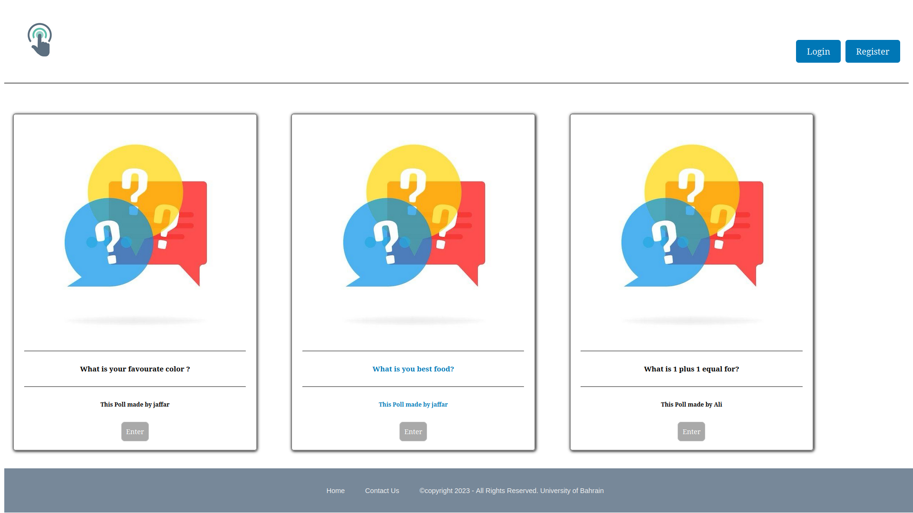
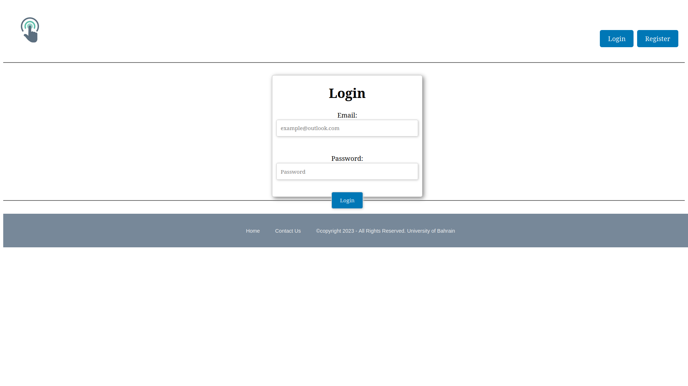
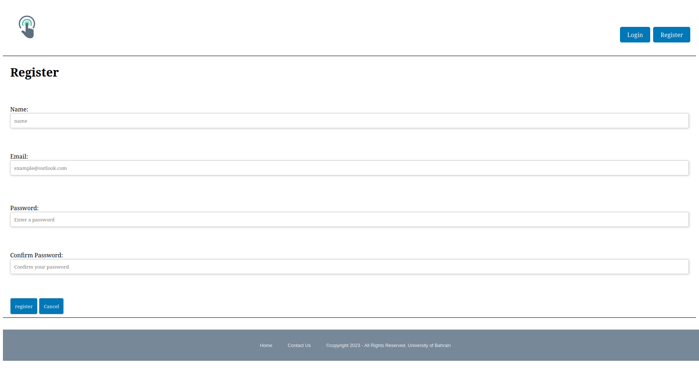
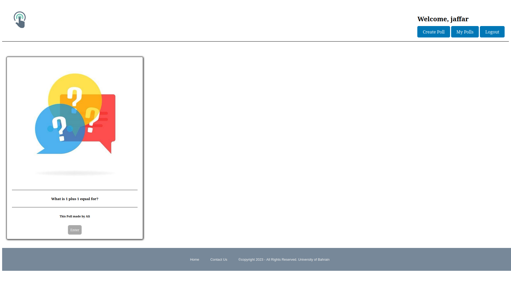
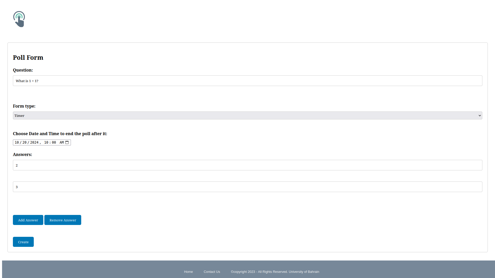
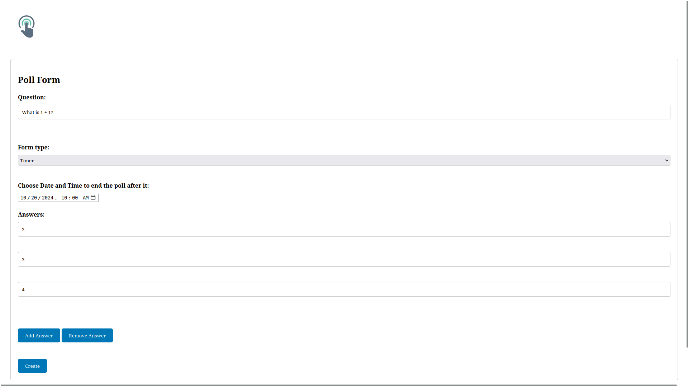
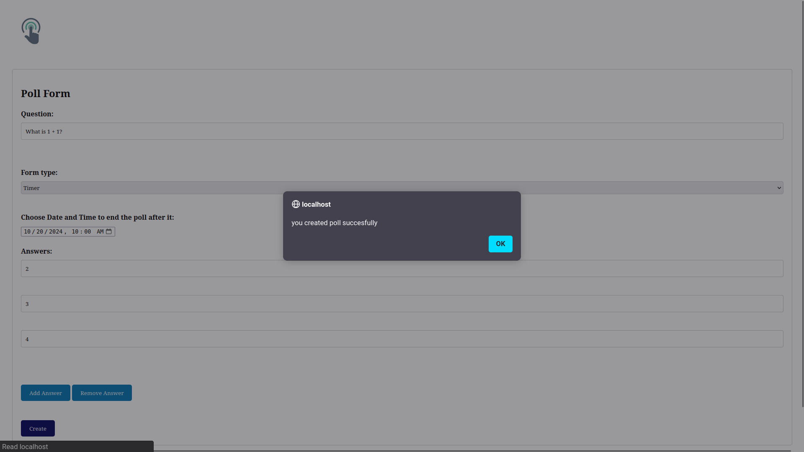
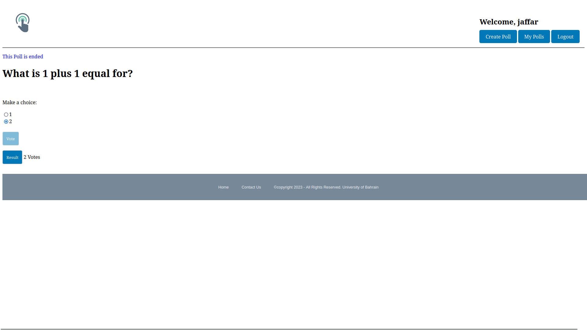
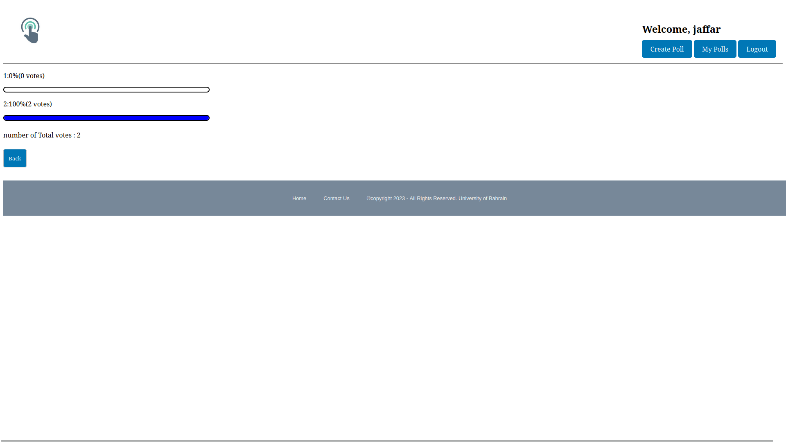

# MakeVote

# Mission Statement

# Table of Contents

1.  [The project is Free And Open-Source](#the-project-is-free-and-open-source)
1.  [Looking around Other Similar Projects](#looking-around-other-similar-projects)
1.  [Choosing a Good Name](#choosing-a-good-name)
1.  [Starting from What You Have](#starting-from-what-you-have)
1.  [Features and Requirements List](#features-and-requirements-list)
1.  [Development Status](#development-status)
1.  [Downloads](#downloads)
1.  [Version Control and Bug Tracker Access](#version-control-and-bug-tracker-access)
1.  [Communication Channels](#communication-channels)
1.  [Developer Guidelines](#developer-guidelines)
1.  [Documentation](#documentation)
1.  [Frequently Asked Questions (FAQ)](#frequently-asked-questions-faq)
1.  [Developer Documentation](#developer-documentation)
1.  [Screenshots](#screenshots)
1.  [Hosting](#hosting)
1.  [Codes of Conduct](#code-of-conduct)
1.  [Announcing](#announcements)
1.  [License](#license)

# The Project is free and open source

MakeVote is an open-source platform for secure and reliable online voting that gives groups a place to hold open, accessible, and transparent elections. Our system, which prioritizes security and accessibility, runs under the MIT License. By empowering organizations to design and oversee their own voting events, MakeVote encourages everyone to take part in the democratic process. MakeVote is the collaborative center for digital democracy, whether you are a developer wishing to contribute to democratic technologies or an organization trying to hold fair elections.

# Looking around Other Similar Projects

Before starting an open-source project, we did our own research to find projects that were competitive and similar to ours. Comparable voting platforms consist of:

- [countmein](https://github.com/democracy-tools/countmein)
- [helios-server](https://github.com/benadida/helios-server)
- [democracyos](https://github.com/DemocracyOS/democracyos)
- [vxsuite](https://github.com/votingworks/vxsuite)

We announced a major initiative to defend the vote against attack, aiming at declaring safe zones for voting everywhere and organizing election protection. The way we looked at it, we wanted to cater for the enterprise side of things all the way down to company level and then schools right through NGOs even community groups. We built a full to voting validation and results with features like ballot generation, voter verification etc at protecting the integrity of every vote while providing fast feedback on election results We set out to create an intuitive interface and most complete feature list in order catalyze the democratic process as a whole, increasing voter access.

# Choosing a Good Name

One of the challenges we had as a team was coming up with an acceptable name for the open-source project before it was introduced.One of the challenges we had as a team was coming up with an acceptable name for the open-source project before it was introduced. The project's name should express both its distinctiveness and a broad sense of its goal. Additionally, the project name ought to be easy to remember and distinct from that of other projects.
In order to select a good name, we all decided to vote on the names VoteSphere, MakeVote, BallotHub, and VoteInsight. We also collectively agreed on the name — "MakeVote" is catchy, action-calling and descriptive. When we did that as part of our own research by looking at every repository — ideally, this is what the more advanced text search function should be doing anyway — we realized not many results come up using this term. In our own investigation we also look through all the repositories, but this name gives us few hits.

# Starting from What You Have

In line with the goals of its creators, the MakeVote Web Application has been converted into an open-source platform that is available to everybody.In line with the goals of its creators, the MakeVote Web Application has been converted into an open-source platform that is available to everybody. Since its inception as a project for the ITCS 333 Internet and Web Development course, MakeVote has undergone tremendous development. To ensure cross-platform compatibility, the coding must now be reorganized.

# Features and Requirements List

## Features Overview:

- _User-Friendly Voting Platform:_ Make voting easy and accessible for all people by providing an intuitive interface.
- _Comprehensive Election Management:_ Assistance with several voting procedures and election formats.
- _Secure Voting Procedure:_ All votes are encrypted from start to finish.
- _Transparent Process:_ Clear voting procedures and guidelines
- _Available Support:_ Provide organizations with convenient ways to get technical assistance and handle election-related issues.

## Requirements:

- You must configure every server environment required for the web application, and XAMPP will be used for this.

- Any text editor for coding or programming can be used. As an example, Visual Studio Code

# Development status

_Version:_ 1.0.0

_Release Date:_ May 05 ,2023

_Project Activity:_ Stable release with no recent updates

_Bugs and Issues:_ No known bugs, extensively tested for security and stability

_Responsive Design:_ Fully responsive for seamless voting experience on various devices

_Community Engagement:_ Currently limited community engagement and seeking user feedback for future enhancements and addition of new features

_Roadmap:_ Considering future updates based on user feedback and security requirements

_Documentation:_ At this time, there is no documentation available; any assistance would be highly valued.

This stable version of "MakeVote" provides organizations with a safe and responsive online voting platform. Security and stability are guaranteed by regular maintenance, and user suggestions for possible future improvements are encouraged. Any help would be greatly appreciated, as there is currently no documentation accessible.

# Downloads

# Version Control and Bug Tracker Access

# Communication Channels

# Developer Guidelines

# Documentation

The complete documentation for the new open-source project is not yet available as the website is still in the early stages of development, as previously mentioned in the development status. If you have the technical skills required for contributing to our project, particularly in server configuration, web development, and security implementation, you should clone the repository, install Apache and MySQL, and then create a new database in phpMyAdmin if you are familiar with version control systems like Git. Before modifying the config.php file, you need to enter your database credentials. Frontend design relies on CSS, but handling the backend functionality requires an understanding of PHP and security best practices.Even though the instructions guide you through the process, users who are already knowledgeable with JavaScript, HTML, PHP, and CSS will find it easier to explore and change MakeVote's frontend. Even though the instructions guide you through the process, users who are already knowledgeable with JavaScript, HTML, PHP, and CSS will find it easier to explore and change MakeVote's frontend.In general, customers that have a basic understanding of web programming fundamentals and cryptographic principles will find it easier to manage the setup and customizing process.

# Frequently Asked Questions (FAQ)

# Developer Documentation

## Overview

The following documentation for MakeVote offers an in-depth look at the codebase of our voting platform and explains how to participate in the contribution process. Our voting system predominantly utilizes PHP, while HTML, CSS, and JavaScript are also important components.

## Table of Contents

1. [Getting Started](#getting-started)
1. [Backend (PHP)](#backend)
1. [Frontend (JavaScript, HTML, CSS)](#frontend)

## Getting Started

1. Clone the repository: git clone https://github.com/MohamedIsa/MakeVote-Project.git
1. Move the project folder to XAMPP's htdocs directory
1. Start XAMPP and ensure MySQL and Apache are running
1. Create a new database in phpMyAdmin
1. Update the config.php file with your database credentials
1. Configure encryption keys and security parameters
1. Open your browser and navigate to http://localhost/MakeVote

## Backend

### PHP

PHP handles the core backend logic. Key files and directories include:

- Database Connection - Models

## Frontend

### JavaScript, HTML, CSS

Frontend components are structured by HTML, styled by CSS, and interactive by JavaScript. Key documents and folders include:

- JavaScript scripts that do front-end tasks
- HTML templates for user interface elements JavaScript scripts that do front-end tasks

This documentation provides a wealth of information for developers wishing to understand, enhance, and expand Elite Website's capabilities and performance.

# Screenshots

Found below are screenshots of the demo website that is hosted:

# Home page

  

# Login page

  

# Sign up page

  

# Taken votes

  

# Creating poll

  

# Adding answer

  

# Poll created

  

# Selected vote

  

# Polls percentage

  

# Hosting

Our website is now a static site built using only HTML and CSS. We are hosting it on Vercel, a platform optimized for static sites. You can access the demo website using the following link:
[here](link.com)

# Code of Conduct

# Announcements

# License
